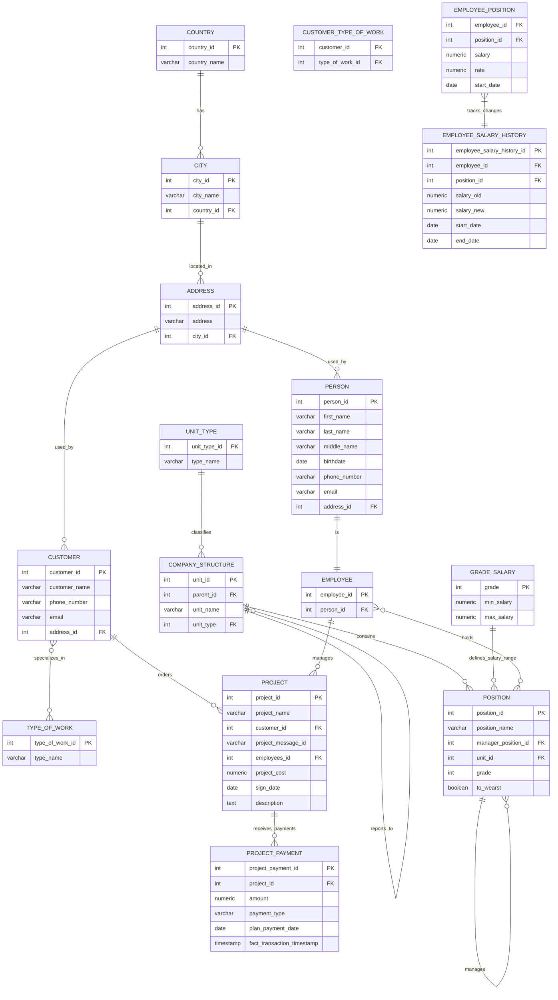

 &nbsp; 

# Data-Analysis-SQL-Pro
🏭 ***Анализ данных компании: от кадров до финансов.***

В этом репозитории представлены решения комплексных аналитических задач для бизнеса, охватывающих кадровую аналитику, финансовые расчеты, операционную эффективность и глубокий анализ данных с использованием SQL.

🎯 ***Ключевые особенности анализа:***
  * работа с иерархическими данными - рекурсивные запросы для анализа организационной структуры;
  * временной анализ - расчет стажа, возраста, накопительных итогов;
  * финансовое моделирование - расчет бонусов, анализ платежей, скользящие средние;
  * комплексная фильтрация - многоуровневые условия отбора данных;
  * оптимизация отчетности - использование материализованных представлений для часто запрашиваемых данных.

🧰 ***Применяемые технологии и методы:***
  * Язык: SQL (ориентирован на PostgreSQL);
  * Ключевые концепции:
    * сложная агрегация данных и фильтрация,
    * рекурсивные запросы для иерархических данных,
    * оконные функции (накопительный итог, сквозная нумерация, скользящее среднее),
    * работа с датами и временем,
    * материализованные представления,
    * подзапросы и CTE (Common Table Expressions).

📚 ***Исходные [данные](./data/stroy.backup) и [описание](./data/description.md) базы данных Stroy***

🗃️ ***Схема базы данных***

📝 ***SQL запросы с решениями и результатами:***

    <table class="solutions-table">
        <thead>
            <tr>
                <th>Категория</th>
                <th>SQL Концепции</th>
                <th>Аналитические задачи и решения</th>
                <th>Ссылка на решение</th>
            </tr>
        </thead>
        <tbody>
            <tr>
                <td rowspan="1"><strong>Анализ проектной деятельности</strong></td>
                <td>Агрегация, фильтрация по датам</td>
                <td>Анализ проектной активности: количество заключенных контрактов в 2023 году</td>
                <td><a href="queries/01_projects-2023.md">📁 просмотреть</a></td>
            </tr>
            <tr>
                <td rowspan="1"><strong>Кадровая аналитика</strong></td>
                <td>Работа с датами, агрегация</td>
                <td>Демографический анализ нового найма: суммарный возраст сотрудников, присоединившихся в 2022</td>
                <td><a href="queries/02_hired-2022-age-sum.md">📁 просмотреть</a></td>
            </tr>
            <tr>
                <td rowspan="1"><strong>Поиск и фильтрация сотрудников</strong></td>
                <td>Строковые функции, сортировка, ограничение результатов</td>
                <td>Поиск ключевых сотрудников: самый опытный работник с фамилией на М (8 букв)</td>
                <td><a href="queries/03_longest-serving-m-surname.md">📁 просмотреть</a></td>
            </tr>
            <tr>
                <td rowspan="1"><strong>Статистика по сотрудникам</strong></td>
                <td>Условные выражения, агрегатные функции</td>
                <td>Анализ уволенного персонала: средний возраст не задействованных в проектах сотрудников</td>
                <td><a href="queries/04_dismissed-no-projects-avg-age.md">📁 просмотреть</a></td>
            </tr>
            <tr>
                <td rowspan="1"><strong>Финансовый анализ</strong></td>
                <td>Суммирование, JOIN таблиц, географическая фильтрация</td>
                <td>Географический анализ платежей: общая сумма поступлений от контрагентов из Жуковский, Россия</td>
                <td><a href="queries/05_zhukovsky-payments-total.md">📁 просмотреть</a></td>
            </tr>
            <tr>
                <td rowspan="1"><strong>Расчет бонусов и ранжирование</strong></td>
                <td>Агрегация, JOIN, оконные функции</td>
                <td>Мотивация руководителей: определение ТОП-менеджера по бонусам за завершенные проекты</td>
                <td><a href="queries/06_top-manager-bonus-completed.md">📁 просмотреть</a></td>
            </tr>
            <tr>
                <td rowspan="1"><strong>Накопительные итоги</strong></td>
                <td>Оконные функции, фильтрация по накопительной сумме</td>
                <td>Финансовое планирование: анализ накопительных авансовых платежей с помесячной детализацией</td>
                <td><a href="queries/07_cumulative-advance-payments-30m.md">📁 просмотреть</a></td>
            </tr>
            <tr>
                <td rowspan="1"><strong>Рекурсивные запросы</strong></td>
                <td>Рекурсия CTE, иерархические данные</td>
                <td>Структурный анализ затрат: фонд оплаты труда подразделения ID=17 с учетом всех дочерних отделов</td>
                <td><a href="queries/08_recursive-salary-department-17.md">📁 просмотреть</a></td>
            </tr>
            <tr>
                <td rowspan="1"><strong>Комплексный анализ данных</strong></td>
                <td>Оконные функции, скользящее среднее, агрегация</td>
                <td> Комплексный финансовый мониторинг: скользящие средние платежей и сравнительный анализ с бюджетом проектов</td>
                <td><a href="queries/09_multi-analysis-payments-projects.md">📁 просмотреть</a></td>
            </tr>
            <tr>
                <td rowspan="1"><strong>Создание отчетных представлений</strong></td>
                <td>Материализованные представления, JOIN множественных таблиц</td>
                <td>Оптимизация отчетности: создание материализованного представления для комплексного анализа проектов и платежей</td>
                <td><a href="queries/10_materialized-view-report.md">📁 просмотреть</a></td>
            </tr>
        </tbody>
    </table>

[queries/](./queries/) - все SQL запросы с решениями 

